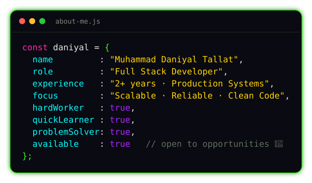

 

 &nbsp;**Full Stack Developer** &nbsp; | **2+ Year Production Experience** &nbsp; | **Building Scalable Systems**

 

&nbsp;

&nbsp;

---

## 🧑‍💻 About Me

 
 

- 🔭 &nbsp;Shipped **production-grade** full-stack applications
- ⚡ &nbsp;Built **large-scale systems** across different domains
- 🔌 &nbsp;Comfortable across the **entire stack** — frontend to backend to database
- 🛠️ &nbsp;Focused on **clean, maintainable, scalable** code

---

## 💻 Tech Stack

**Frontend**

**Backend**

**Databases & ORM**

**Tools & Platforms**

---

---

### ✍️ Dev Quote

  

---

  

